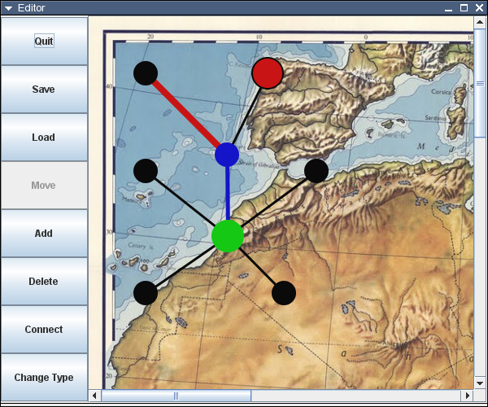

The Lost Diamond
================
Student project. In implementation of the board game "The Lost Diamond".
There's a map editor and a game.

Usage
=====
Running:

    ant
    java -jar Game.jar
    #or
    java -jar Editor.jar
    
Screenshots
===========

